# 🛡️ ExamGuard — Autonomous AI Proctoring & Examination Integrity Suite

> **Privacy-First, Edge-Assisted Neural Monitoring, Multi-Modal Sensor Fusion, and Real-Time Invigilator Operations.**

---

[](https://opensource.org/licenses/MIT)
[](https://python.org)
[](https://fastapi.tiangolo.com)
[](https://react.dev)
[](https://vitejs.dev)
[](https://developers.google.com/mediapipe)
[](https://docs.ultralytics.com)
[](https://developer.mozilla.org/en-US/docs/Web/API/WebSockets_API)

---

## 📌 Table of Contents

- [Executive Overview](#-executive-overview)
- [System Visual Tour & Screenshots](#-system-visual-tour--screenshots)
  - [1. Authentication & Portal Gateway](#1-authentication--portal-gateway)
  - [2. Student Exam Session & Live Telemetry](#2-student-exam-session--live-telemetry)
  - [3. Edge AI Real-Time Integrity Warnings](#3-edge-ai-real-time-integrity-warnings)
  - [4. Invigilator Live Command Center](#4-invigilator-live-command-center)
  - [5. Exam Cohort & Question Bank Management](#5-exam-cohort--question-bank-management)
  - [6. Session Reports & Proctoring Evidence Ledger](#6-session-reports--proctoring-evidence-ledger)
- [Core Architecture & Technical Features](#-core-architecture--technical-features)
  - [Edge-Side Computer Vision Engine](#-edge-side-computer-vision-engine)
  - [Web Audio FFT Spectral Analyzer](#-web-audio-fft-spectral-analyzer)
  - [Browser & System Integrity Enforcer](#-browser--system-integrity-enforcer)
  - [Temporal Debouncing & Keyframe Snapshot Engine](#-temporal-debouncing--keyframe-snapshot-engine)
  - [Bi-Directional WebSocket Multiplexing](#-bi-directional-websocket-multiplexing)
- [System Architecture & Data Flow](#-system-architecture--data-flow)
- [Technology Matrix](#-technology-matrix)
- [REST API & WebSocket Specification](#-rest-api--websocket-specification)
- [Database Schema & ERD](#-database-schema--erd)
- [Local Installation & Setup Guide](#-local-installation--setup-guide)
- [Production Deployment Guide](#-production-deployment-guide)
- [Automated Testing](#-automated-testing)
- [License & Authors](#-license--authors)

---

## 🚀 Executive Overview

**ExamGuard (VigilProctor)** is an end-to-end autonomous examination proctoring suite engineered to guarantee academic integrity in remote assessment environments without compromising candidate privacy or incurring prohibitive cloud GPU costs.

Traditional cloud video proctoring streams continuous high-definition video feeds to remote servers, consuming massive network bandwidth and raising serious student privacy concerns. **ExamGuard solves this through Edge AI Multi-Modal Sensor Fusion**:

- **100% On-Device Neural Inference**: Face landmark tracking, head pose estimation (Yaw, Pitch, Roll), iris/pupil gaze tracking, and acoustic FFT spectral voice detection execute directly inside the candidate's browser via WebAssembly, MediaPipe, and ONNX Runtime.
- **Privacy-Preserving Keyframe Evidence**: No continuous video streams leave the candidate's machine. The system captures instant high-resolution image snapshots (`frame_path` / `thumbnail_path`) exclusively upon confirmed integrity threshold breaches.
- **Real-Time Invigilator Dashboard**: Low-latency bi-directional WebSockets push live anomaly telemetry, candidate readiness indicators, and keyframe snapshots directly to proctors supervising active cohorts.
- **Comprehensive Exam Lifecycle Operations**: Features dynamic exam cohort creation, batch CSV/JSON question uploading, auto-graded scorecards, and audit-ready PDF/CSV session reports.

---

## 📸 System Visual Tour & Screenshots

### 1. Authentication & Portal Gateway

The unified landing portal allows candidates and invigilators to select their workspace with biometric calibration and institutional single sign-on access.

| Portal Selection Gateway | Invigilator Authentication |
|---|---|
| 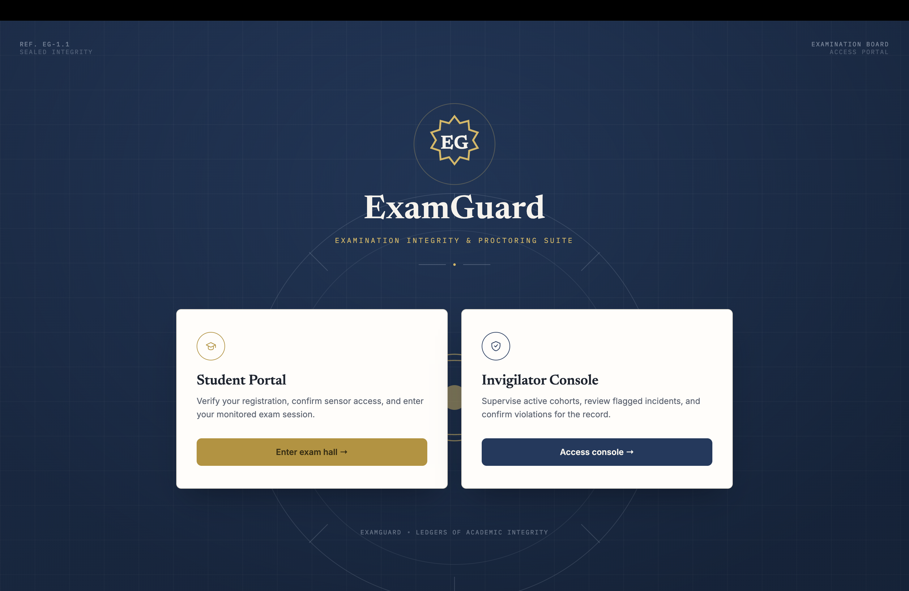 | 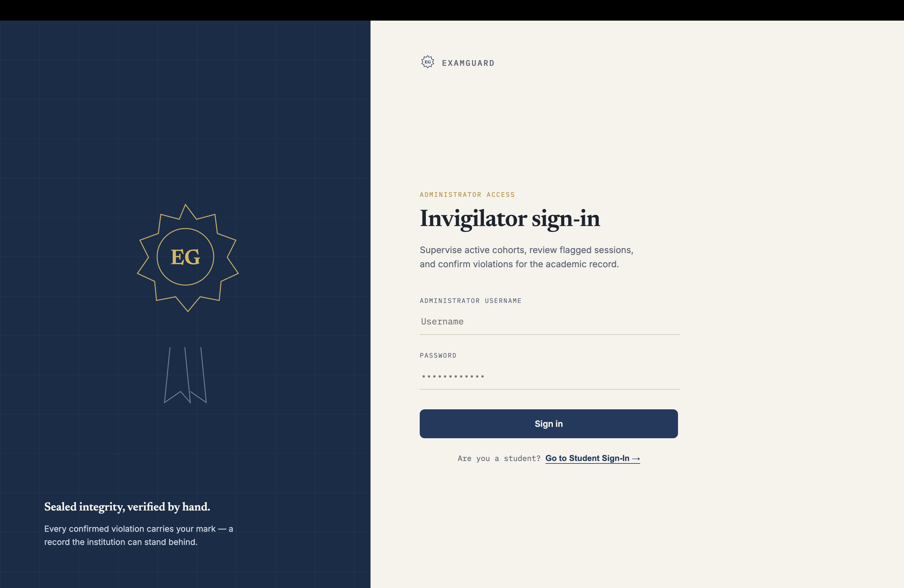 |

---

### 2. Student Exam Session & Live Telemetry

Before entering an exam, the student portal runs self-healing sensor calibration to verify camera feeds, WebAssembly neural engines, and microphone frequency responses. During the exam, a live telemetry HUD displays real-time head pose ratios, gaze coordinates, and microphone decibel levels.

| Pre-Exam Sensor Calibration | Student Exam Interface & Telemetry HUD |
|---|---|
| 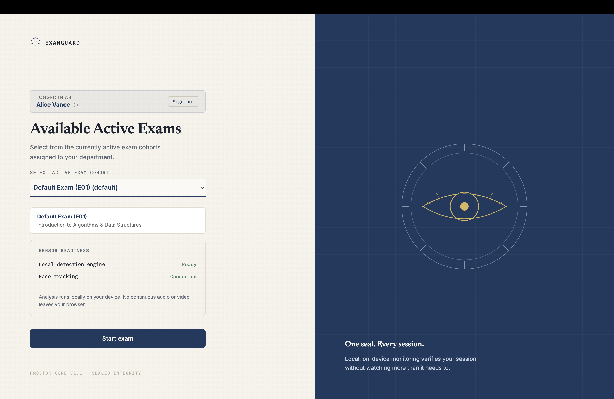 | 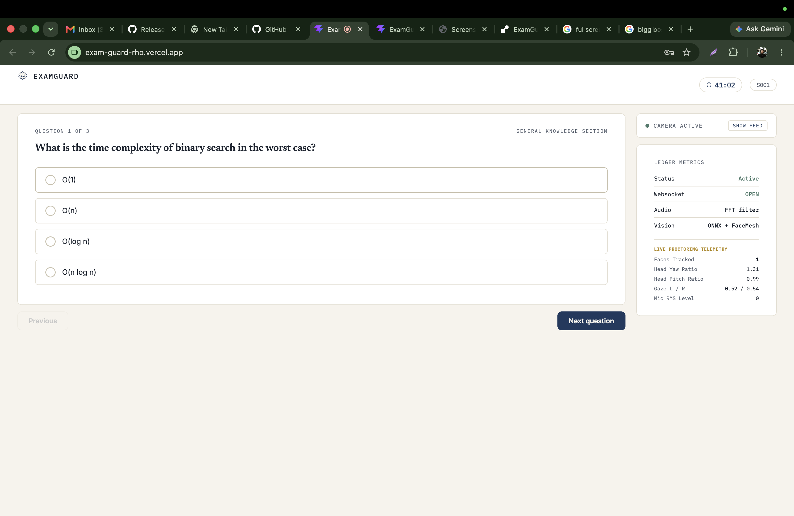 |

---

### 3. Edge AI Real-Time Integrity Warnings

When anomalous behavior breaches temporal debouncing thresholds (3.0 seconds for visual anomalies, 2.0 seconds for acoustic anomalies), an overlay warning triggers on the candidate's screen while transmitting an encrypted alert payload to the invigilator dashboard.

| Head Yaw / Pose Deviation | Multi-Person Detection | Face Obstruction Warning |
|---|---|---|
| 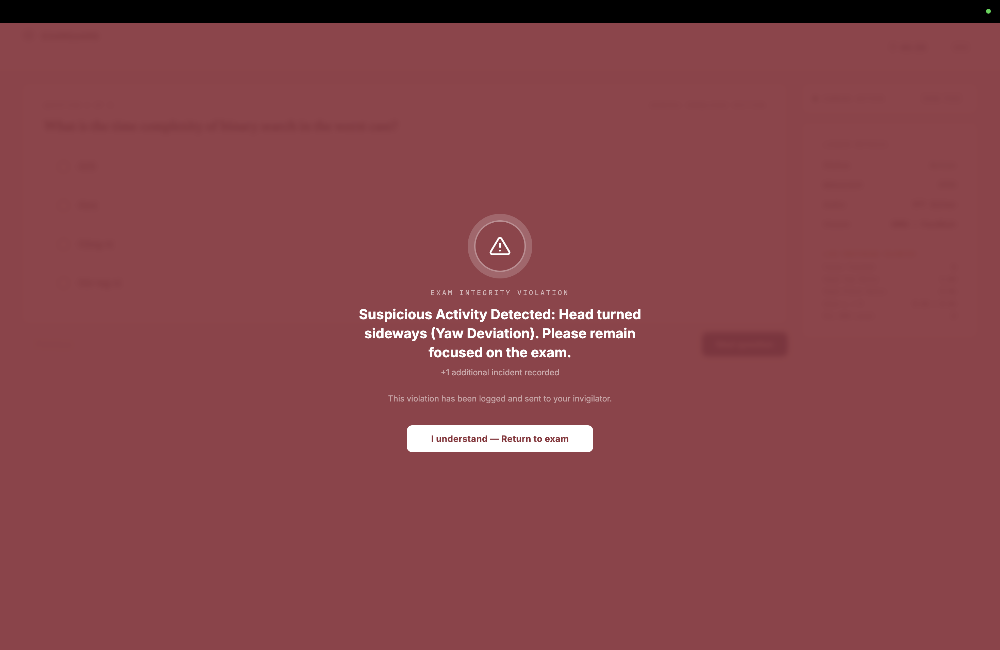 | 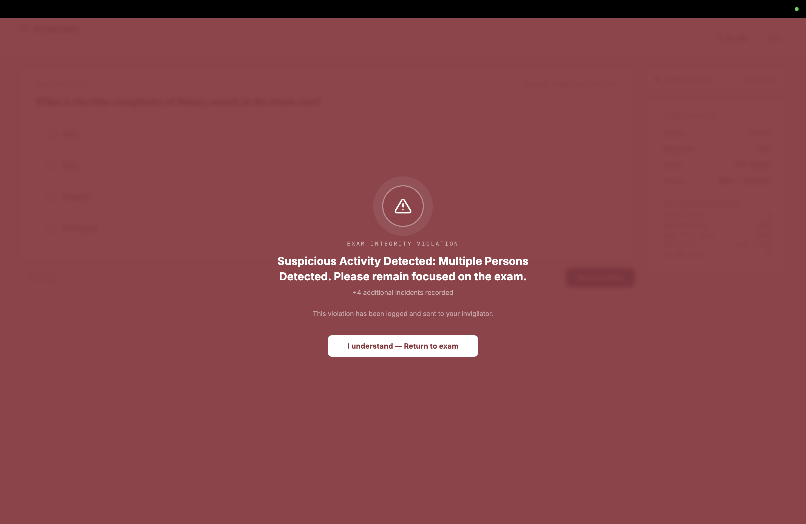 | 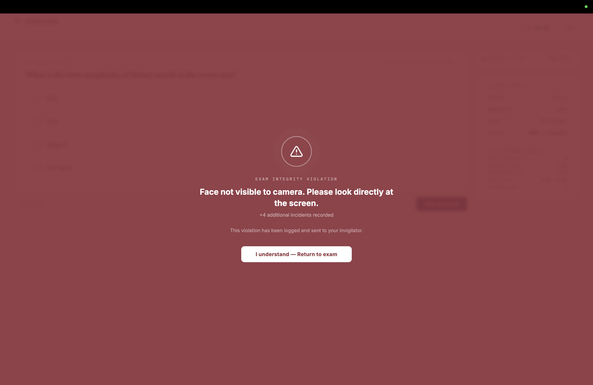 |

---

### 4. Invigilator Live Command Center

Invigilators monitor active exam cohorts in real time via live webcam cards, real-time alert log streams, and status badges (`GREEN` / `YELLOW` / `RED`).

| Live Cohort Feed & Incident Stream | Multi-Student Cohort Grid |
|---|---|
| 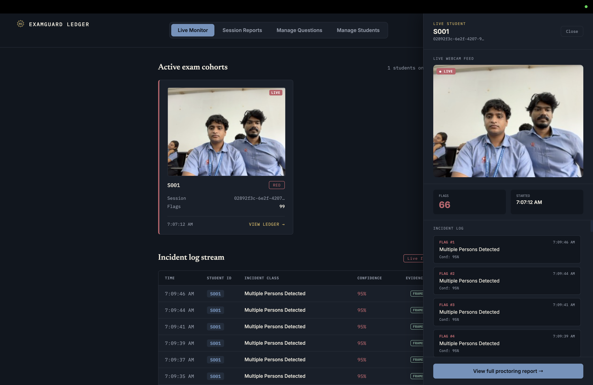 | 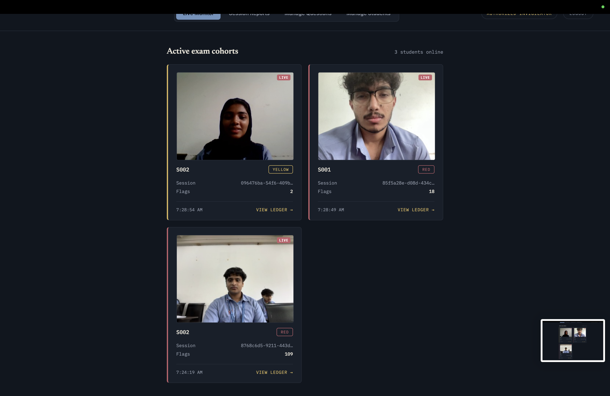 |

---

### 5. Exam Cohort & Question Bank Management

Proctors can manage multiple active exam cohorts, configure test parameters, create custom multiple-choice questions, or batch-import question sets via JSON or CSV files.

| Exam Cohorts Directory | Question Bank & Batch Import | Custom Question Form |
|---|---|---|
| 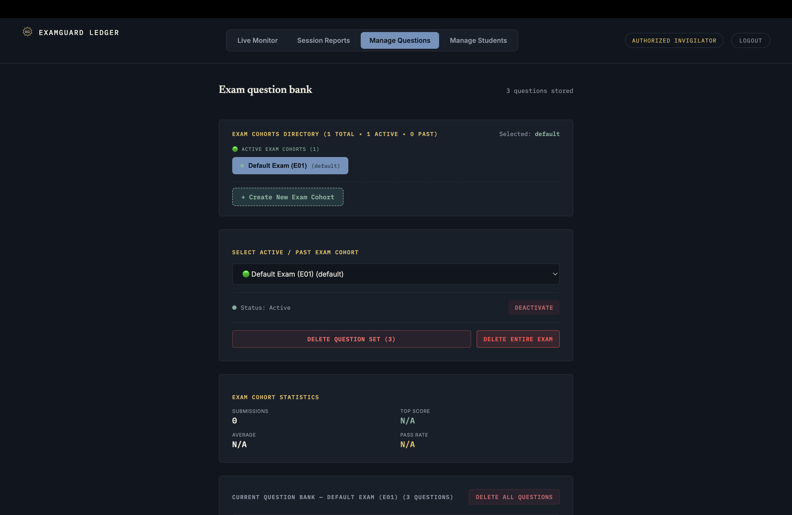 | 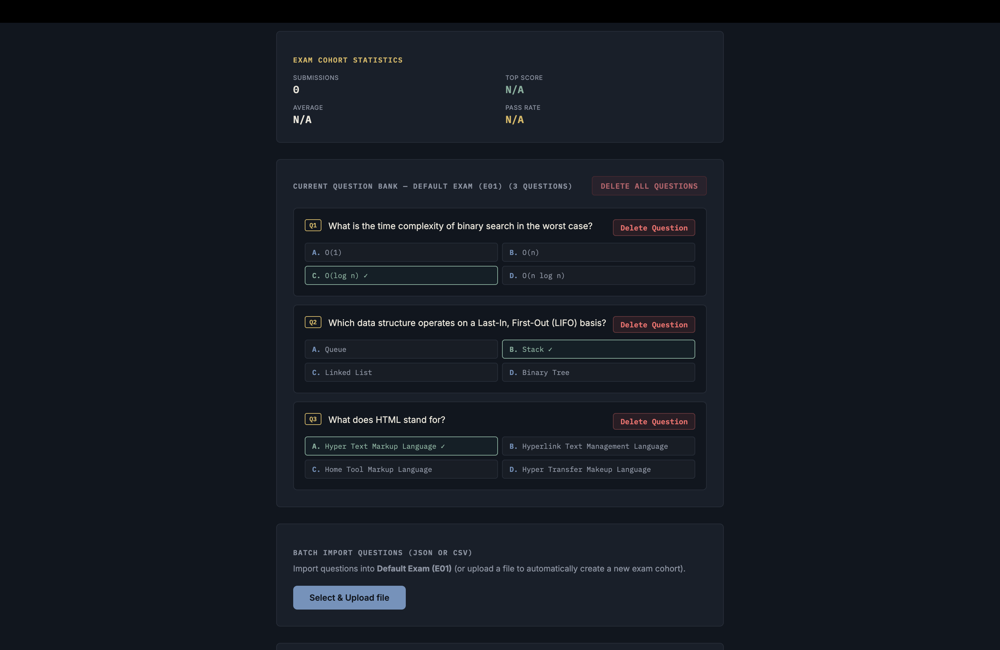 | 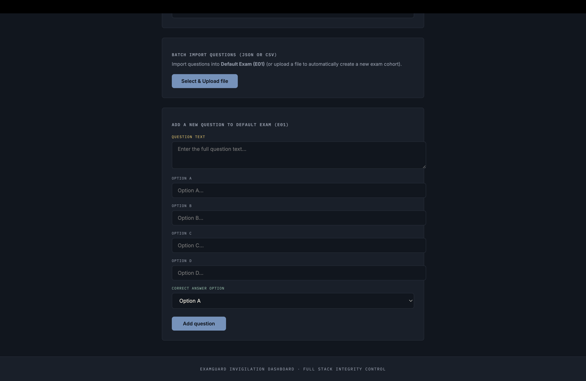 |

---

### 6. Session Reports & Proctoring Evidence Ledger

The institutional evidence ledger stores comprehensive session statistics, timeline incident graphs, candidate scorecards, and instant image keyframe evidence.

| Proctoring Ledger & Timeline Graph | Automated Student Scorecard |
|---|---|
| 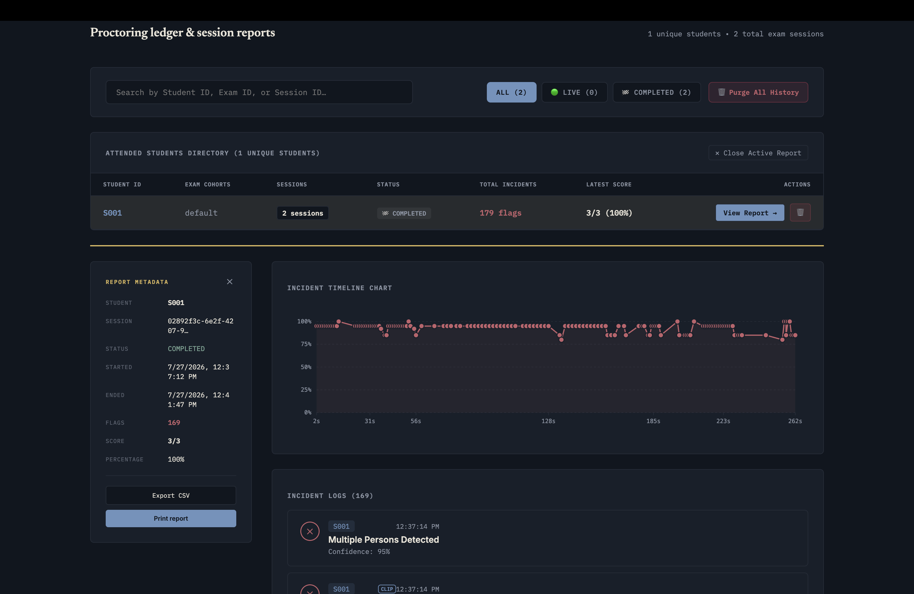 | 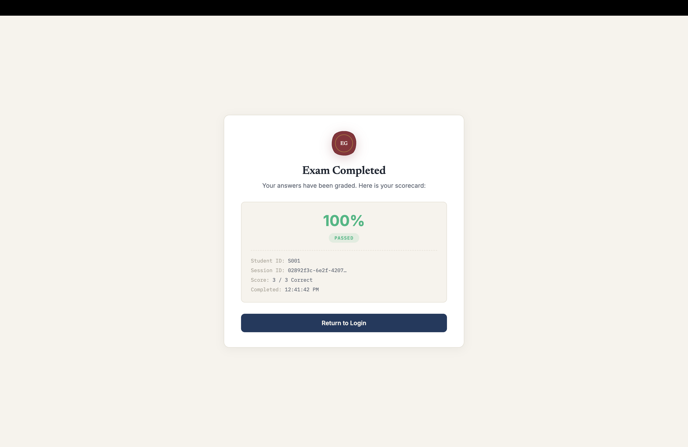 |

---

## 🔬 Core Architecture & Technical Features

### 🧠 Edge-Side Computer Vision Engine

1. **Google MediaPipe Face Mesh (468 3D Landmarks)**:
   - Tracks 468 3D facial landmarks at 30+ FPS directly in the browser.
   - Computes **Head Yaw** (left/right rotation) and **Head Pitch** (up/down inclination) by measuring euclidean distances between facial anchor points (nose tip `#1`, chin `#152`, left eye corner `#33`, right eye corner `#263`) relative to a calibrated baseline plane.
2. **Iris Pupil Gaze Tracking**:
   - Isolates eye bounding boxes and tracks pupil position relative to inner/outer eye corners (`Gaze L/R` ratio). Sustained eye gaze deflection away from the exam area triggers a gaze anomaly.
3. **PyTorch & YOLOv8 Object Detection**:
   - Utilizes YOLOv8n to identify secondary unauthorized devices (cell phones, tablets, physical cheat sheets) and multi-person presence.
4. **Self-Healing Fallback Architecture**:
   - Features automatic CDN retry loops, graceful degraded mode (fallback without iris refinement if script loads lag), and lazy initialization upon video start.

---

### 🎙️ Web Audio FFT Spectral Analyzer

- Leverages the browser **Web Audio API** to construct an `AudioContext` and `AnalyserNode`.
- Runs a **Fast Fourier Transform (FFT)** in real time, isolating frequency bands associated with human speech ($85\text{Hz} - 255\text{Hz}$).
- Computes Root Mean Square (RMS) decibel levels to flag whispering, secondary voices, or background audio assistance while filtering out constant white noise.

---

### 💻 Browser & System Integrity Enforcer

- **Page Visibility API & Blur Listeners**: Tracks window focus state, detecting desktop tab switches, split-screen application switching, or window minimization.
- **Fullscreen Lockdown**: Prompts candidates to remain in full-screen mode throughout the exam duration.

---

### ⏱️ Temporal Debouncing & Keyframe Snapshot Engine

- **False-Positive Prevention**: Isolated single-frame actions (such as adjusting glasses or a momentary blink) are debounced. Visual infractions must persist continuously for **3.0 seconds** ($\sim 90$ frames) and audio infractions for **2.0 seconds** before an official anomaly event is registered.
- **Instant Image Keyframe Snapshot**: Once debounced, the client captures a high-resolution base64 snapshot from the active canvas stream and sends it to `/api/sessions/{session_id}/alert/{alert_id}/frame`. The backend decodes and archives the snapshot under `/static/frames/` and `/static/thumbnails/`.

---

### ⚡ Bi-Directional WebSocket Multiplexing

- **Candidate Connection (`/ws/exam/{session_id}`)**: Streams live telemetry metrics, alert events, and candidate heartbeat signals to the server.
- **Invigilator Connection (`/ws/invigilator/{client_id}`)**: Broadcasts cohort-wide anomaly streams, status color transitions (`GREEN` $\rightarrow$ `YELLOW` $\rightarrow$ `RED`), and evidence updates instantly to all connected proctor consoles.

---

## 📐 System Architecture & Data Flow

```mermaid
graph TD
    subgraph Client Browser [Student Exam Portal - Edge AI]
        WC[Webcam Feed & Mic Stream] --> FM[MediaPipe FaceMesh - 468 Landmarks]
        WC --> FFT[Web Audio API - FFT Voice Band Analyzer]
        WC --> Canvas[Hidden HTML5 Canvas Capture]
        
        FM --> Pose[Head Pose: Yaw & Pitch Estimation]
        FM --> Gaze[Pupil / Iris Gaze Tracking]
        
        Pose --> Debounce{Temporal Debouncing Window<br/>Visual: 3.0s | Audio: 2.0s}
        Gaze --> Debounce
        FFT --> Debounce
        
        Debounce -->|Anomaly Confirmed| Keyframe[Capture Base64 Image Keyframe]
        Keyframe --> WS_Out[WebSocket & REST Transmit]
    end

    subgraph Backend Server [FastAPI Backend]
        WS_Out --> WS_Manager[WebSocket Connection Manager]
        WS_Out --> REST_Api[FastAPI REST Router]
        
        REST_Api --> DB[(SQLite Database)]
        REST_Api --> Static[Disk Storage: /static/frames/]
        
        WS_Manager --> Broadcast[Invigilator Broadcast Queue]
    end

    subgraph Invigilator Dashboard [Proctor Control Console]
        Broadcast --> DashboardUI[Real-Time Live Cohort Monitor & Alert Stream]
        DashboardUI --> EvidenceModal[Proctoring Evidence Ledger & Keyframe Viewer]
    end
```

---

## 🛠️ Technology Matrix

| Layer | Technology | Purpose / Role |
|---|---|---|
| **Frontend Framework** | React 19 + TypeScript + Vite 6 | Unified single-page application for student exam & invigilator portal |
| **Styling & Design System** | Vanilla CSS3 (Custom Design System) | Dark mode, glassmorphism, responsive grid, custom typography |
| **Computer Vision Engine** | Google MediaPipe FaceMesh | 468 3D facial landmarks, head pose estimation, pupil tracking |
| **Neural Inference** | PyTorch / YOLOv8n | Object detection (mobile devices, secondary books, multiple persons) |
| **Audio Processing** | Web Audio API (FFT AnalyserNode) | Spectral speech frequency band analysis & RMS volume calculation |
| **Backend Framework** | FastAPI + Uvicorn | Async Python backend, WebSocket multiplexer, static media server |
| **Database** | SQLite + SQLAlchemy ORM | Relational storage for sessions, alerts, cohorts, questions, users |
| **Protocols** | WebSockets (`wss://`) + REST JSON | Bi-directional real-time alert streaming and API transactions |
| **Testing** | Pytest + Vitest | Automated backend unit testing and frontend component verification |

---

## 🌐 REST API & WebSocket Specification

### REST Endpoints

#### Authentication (`/api/auth`)
- `POST /api/auth/student-login`: Authenticates student candidates using student ID and secret credentials.
- `POST /api/auth/admin-login`: Authenticates proctors/administrators returning a JWT authorization payload.

#### Exam Cohorts & Questions (`/api/questions`)
- `GET /api/questions/cohorts`: Returns active and past exam cohorts with submission statistics.
- `POST /api/questions/cohorts`: Creates a new exam cohort.
- `GET /api/questions/{cohort_id}`: Retrieves questions belonging to a specific cohort.
- `POST /api/questions/upload`: Uploads and parses question sets in CSV or JSON format.
- `POST /api/questions`: Adds an individual custom question.

#### Proctoring Sessions & Evidence (`/api/sessions` & `/api/reports`)
- `GET /api/sessions/active`: Retrieves all live student exam sessions.
- `GET /api/reports/ledger`: Fetches historical proctoring ledger records and timeline charts.
- `POST /api/sessions/{session_id}/alert`: Registers a new anomaly incident.
- `POST /api/sessions/{session_id}/alert/{alert_id}/frame`: Uploads base64 keyframe screenshot evidence.
- `POST /api/reports/alerts/{alert_id}/override`: Allows invigilator to mark an alert as **Confirmed** or **Dismissed**.

---

### WebSocket Protocols

#### Candidate Endpoint: `/ws/exam/{session_id}`
Client sends real-time heartbeat and telemetry payloads:
```json
{
  "type": "telemetry",
  "student_id": "S001",
  "faces_tracked": 1,
  "head_yaw": 1.12,
  "head_pitch": 0.98,
  "gaze_ratio": 0.51,
  "audio_rms": 12.4
}
```

#### Invigilator Endpoint: `/ws/invigilator/{client_id}`
Server broadcasts live incident updates to all subscribed proctor dashboards:
```json
{
  "type": "new_alert",
  "session_id": "02892f3c-6e2f-4207-9512-...",
  "student_id": "S001",
  "anomaly_type": "Head Yaw Deviation (Looking Left)",
  "confidence": 95,
  "timestamp": "2026-07-27T12:40:47Z",
  "frame_path": "/static/frames/02892f3c_14.jpg"
}
```

---

## 🗄️ Database Schema & ERD

```
┌─────────────────────────┐       ┌─────────────────────────┐
│      exam_cohorts       │       │        questions        │
├─────────────────────────┤       ├─────────────────────────┤
│ id (PK)                 │───┐   │ id (PK)                 │
│ title                   │   └──>│ cohort_id (FK)          │
│ description             │       │ question_text           │
│ is_active               │       │ option_a, option_b...   │
│ created_at              │       │ correct_option          │
└─────────────────────────┘       └─────────────────────────┘
             │
             │
             ▼
┌─────────────────────────┐       ┌─────────────────────────┐
│      exam_sessions      │       │     session_alerts      │
├─────────────────────────┤       ├─────────────────────────┤
│ id (PK, UUID)           │───┐   │ id (PK)                 │
│ student_id              │   └──>│ session_id (FK)         │
│ cohort_id (FK)          │       │ anomaly_type            │
│ status                  │       │ confidence              │
│ total_flags             │       │ frame_path              │
│ score                   │       │ thumbnail_path          │
│ start_time, end_time    │       │ override_status         │
└─────────────────────────┘       └─────────────────────────┘
```

---

## 💻 Local Installation & Setup Guide

### Prerequisites

- **Python 3.11** or higher
- **Node.js 18** or higher (`npm 9+`)
- **Git**

---

### Step 1: Clone Repository & Create Virtual Environment

```bash
git clone https://github.com/mizhab-as/VigilProctor.git
cd VigilProctor

# Create Python virtual environment
python3 -m venv venv
source venv/bin/activate  # On Windows use: venv\Scripts\activate

# Install Backend Dependencies
pip install -r requirements.txt
```

---

### Step 2: Install Frontend Dependencies

```bash
cd client
npm install
cd ..
```

---

### Step 3: Launch System (Unified Command)

Run the root shell script to boot both FastAPI backend server and Vite client portal simultaneously:

```bash
chmod +x run.sh
./run.sh
```

Or run services individually:

```bash
# Terminal 1: Backend Server (FastAPI)
uvicorn backend.app.main:app --host 0.0.0.0 --port 8000 --reload

# Terminal 2: Frontend Client (Vite)
cd client
npm run dev
```

---

### Access URLs & Default Credentials

| Portal | URL | Default Credentials |
|---|---|---|
| **Unified Portal Gateway** | `http://localhost:3000` | N/A |
| **Student Exam Portal** | `http://localhost:3000` | ID: `S001` (or import CSV) |
| **Invigilator Control Console** | `http://localhost:3000` | User: `admin` / Pass: `admin123` |
| **FastAPI OpenAPI Swagger Docs** | `http://localhost:8000/docs` | N/A |

---

## ☁️ Production Deployment Guide

### Deployment Architecture

```
Frontend (Vercel SPA) ──[HTTPS / WSS]──> Backend (Render / Railway Web Service + SQLite)
```

---

### Step 1: Deploy Backend (Render / Railway)

1. Connect your repository to **Render** or **Railway**.
2. Select **Root Directory**: `backend`
3. Set **Build Command**: `pip install -r requirements.txt`
4. Set **Start Command**: `uvicorn app.main:app --host 0.0.0.0 --port $PORT`
5. Configure Environment Variables:
   - `PYTHON_VERSION` = `3.11.0`

---

### Step 2: Deploy Frontend (Vercel)

1. Connect repository to **Vercel**.
2. Set **Root Directory**: `client`
3. Configure Environment Variables:
   - `VITE_API_URL` = `https://your-backend.onrender.com`
   - `VITE_WS_URL` = `wss://your-backend.onrender.com`
4. Deploy!

---

## 🧪 Automated Testing

Execute backend automated unit tests using `pytest`:

```bash
pytest backend/tests -v
```

---

## 📄 License & Authors

Distributed under the **MIT License**. See `LICENSE` for more information.

**ExamGuard Development Team**  
*Built with precision for academic integrity.*
